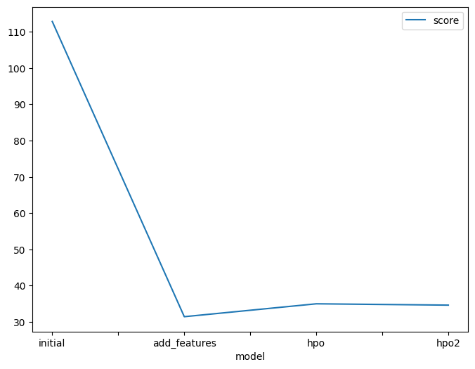
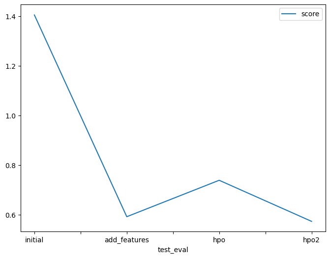

# Report: Predict Bike Sharing Demand with AutoGluon Solution
#### Chunyan He 

## Initial Training
### What did you realize when you tried to submit your predictions? What changes were needed to the output of the predictor to submit your results?
TODO: The raw output of AutoGluon predictor was not in the required submmision format. it only returns a single column of prediction values while kaggle require a CSV file with specific column names and a row identifier that matches the test set. 
I created a CSV for raw output by using the provided submission.csv tempalte. 

### What was the top ranked model that performed?
TODO: the best morel in each experiment: initial - WeightedEnsemble_L3, new_feature - WeightedEnsemble_L3, new_hpo - WeightedEnsemble_L2 
among all three experiments, the best model is new_hpo - WeightedEnsemble_L2, the one used hyperparameter tunning has the best score of both RMSE and Kaggle

## Exploratory data analysis and feature creation
### What did the exploratory analysis find and how did you add additional features?
TODO: EDA revealed that hour, temp, atemp, humidity, and windspeed have noticeable correlations with target - 'count', while holiday and workingday show weaker effects. Based on these insights, I created additional features from datetime - 'hour'. Moreover, I also noticed that registered users tend to have higher usageof rental bikes than casual users.

### How much better did your model preform after adding additional features and why do you think that is?
TODO: With the EDA process, I noticed that 'datetime' column is in the format of year, month, day, hours. Therefore, I extracted hour from it and created a new feature with it. The addition of the new feature helps the model performance improved significantly compared to the previous model version according to kaggle score and RMSE score. 
The reason was mostly because the model gained access to more explicit imformation. Extracting the hour from the datetime column improved model performance because the raw datetime is not directly informative. The original 'datetime' values is hard for the model to find patterns. the new feature 'hour' created can capture daily cyclical patterns for the model. Which provides a meaningful, repeatable signal that the model can leverage. Additionally, using hour reduces noise and sparsity compared to the full timestamp, allowing the model to learn temporal dependencies more effectively.

## Hyper parameter tuning
### How much better did your model preform after trying different hyper parameters?
TODO: Hyperparameter tuning on the dataset that included the new feature led to only a small change in performance compared to the model with the added feature alone. While the tuned model did not outperform the feature-engineered model in this case, it still performed substantially better than the initial model without the new feature. This indicates that feature engineering had a larger impact on performance than hyperparameter optimization, and tuning provided minor refinements rather than major gains in this experiment.

### If you were given more time with this dataset, where do you think you would spend more time?
TODO: I would deffinitely spend more time on hyperparameter tuning and feature engineering. 
On the feature side, I would explore new transformations of existing columns, extract additional temporal or categorical patterns, and consider interaction features that might capture complex relationships in the data.
For hyperparameter tuning, I would systematically experiment with a wider range of settings for different model types, including tree-based, linear, and ensemble models, to identify the optimal combination of parameters. 

### Create a table with the models you ran, the hyperparameters modified, and the kaggle score.
| No. | model        | hpo1 | hpo2 | hpo3 | score   |
|-----|-------------|------|------|------|---------|
| 0   | initial      | NaN  | None | None | 1.40545 |
| 1   | add_features | NaN  | None | None | 0.59140 |
| 2   | hpo          | 0.0  | auto | None | 0.73840 |
| 3   | hpo2         | 0.0  | auto | None | 0.57263 |

Since there is no hyperparameter tunning in the initial model and add_features model, I put 'None' for hpo1/hpo2/hpo3 of these two models.
The hpo3 model is the extra hyperparameter tunning I did. 

### Create a line plot showing the top model score for the three (or more) training runs during the project.

TODO: Replace the image below with your own.

### Create a line plot showing the top kaggle score for the three (or more) prediction submissions during the project.

TODO: Replace the image below with your own.

## Summary
TODO: In this project, I predicted bike sharing demand using AutoGluon, exploring the effects of feature engineering and hyperparameter tuning. 
The model performance comparison of the initial experiments and adding new feature experiment highlighted that the raw datetime column did not provide meaningful signals, but extracting the hour as a new feature significantly improved model performance by capturing daily cyclical patterns. 
Hyperparameter tuning on the enhanced dataset provided minor improvements, indicating that feature engineering had a larger impact than tuning in this case. 
Moreover, I performed additional hyperparameter tuning by including more models and adjusting other settings, while also creating a new feature that categorizes hours into time periods(morning rush/lunch/evening rush/off-peak). This version(hpo2 model) achieved better performance than hpo model. Compared to add_feature model, the RMSE was slightly higher, but the Kaggle score improved slightly, showing that careful feature engineering combined with targeted hyperparameter adjustments can further refine predictions.
Overall, the combination of targeted feature creation and model optimization led to substantial reductions in RMSE and better Kaggle scores. Given more time, further exploration of additional features, interactions, and more systematic hyperparameter tuning across multiple model types could potentially improve performance even further.
